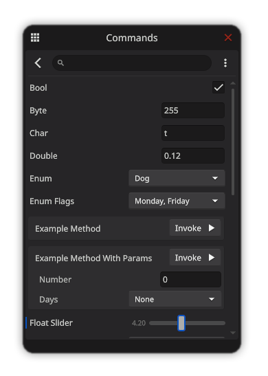

# Dev Console

Built with Unity UIElements, battle tested in Unity 6+

WebGL Demo: ([https://noopol.com/dev-console-demo/](https://noopol.com/dev-console-demo/))



## Usage

1. Copy the `/Runtime/DevToolkit/` somewhere in you Assets folder, DevToolkit has no third-party dependancies, or install the whole [NooTools](../../) package.

2. Drag `\Packages\com.noo.tools\Runtime\DevToolkit\Assets\DevConsole.prefab` to Scene.

3. You will need to write your own script to enable/disable that GameObject, for example: 

```cs
using UnityEngine;
using UnityEngine.InputSystem;
using Noo.DevToolkit;

public class DevConsoleManager : MonoBehaviour
{
    public DevConsole devConsole;
    public InputActionReference toggleAction;

    private void Awake()
    {
        if (devConsole && toggleAction != null && toggleAction.action != null)
        {
            toggleAction.action.performed += (e) =>
            {
                if (devConsole) devConsole.gameObject.SetActive(!devConsole.gameObject.activeSelf);
            };
        }
    }
}
```
4. Add `[DevAssembly]` attribute to your namespace.
5. Add `[DevCommand]` on your properties, fields or methods,

   or `[DevCommands]` on your classes to automatically create commands for each of its properties, fields or methods.

## Attributes

### `[DevAssembly]`
This needs to be included once per assembly to let the console know where to search and parse all other attributes

### `[DevCommand]`
Use it on field, property or method to create drawer in dev console. It can be used on static properties or MonoBehaviour/ScriptableObject properties (if used on Unity objects, target will be identified by utilizing `FindAnyObjectByType(FindObjectsInactive.Exclude)`)

#### Properties

|Type|Name|Description|
|--|--|--|
|string|PathName|Override the relative path name like "CustomGroup/ItemName" or an absolute path like "/CustomCategory/CustomGroup/ItemName". Member name by default.|
|string|Info|Additional info for this command displayed in the inspector.|
|int|Order|Drawing order for the command.|
|bool|Inline|Only used by Method drawers to draw method inline. (default: true)|

### `[DevCommands]`
Use it on a class to auto-generate commands from all its fields, properties and methods.

#### Properties

|Type|Name|Description|
|--|--|--|
|string|PathName|Override the relative path name like "CustomGroup/ItemName" or an absolute path like "/CustomCategory/CustomGroup/ItemName". Member name by default.|
|int|Order|Drawing order for the command.|
|BindingFlags|GenerateMemberFlags|Auto generate DevCommands from all members matching these binding flags. (example: `BindingFlags.Static | BindingFlags.Public`)|
|MemberTypes|GenerateMemberTypes|Auto generate DevCommands from all members of this type. (default: `MemberTypes.All`)|


## Special Drawers

Special drawers can be used in combination with [DevCommand] to decorate drawer for property fields or method parameters. 

### `[DevDropdown]`
Use it on field or property to draw Dropdown box of predefined values. Predefined values should be in static field, property or method. These are the valid types for Dropdown data source:
	- `IReadOnlyDictionary<object, string>`
	- `IEnumerable<(object, string)>`
	- `IEnumerable`

#### Properties

|Type|Name|Description|
|--|--|--|
|string|Items|local or fullpath (including Namespace) to a static member.|
|string|Parameter|If DevDropdown is used on method, you must specify Parameter name to which to apply decorator.|

### `[DevSlider]`
Use it on field or property to draw Slider component.

#### Properties

|Type|Name|Description|
|--|--|--|
|float|Min|Minimum value for the slider|
|float|Max|Maximum value for the slider|
|string|Parameter|If DevDropdown is used on method, you must specify Parameter name to which to apply decorator.|

## Example Code

```cs
using Noo.DevToolkit;

[assembly: DevAssembly]
namespace TestNamespace
{
	[DevCommands(GenerateMemberFlags = BindingFlags.Static | BindingFlags.Public)]
	public static class TestAutoGenCommands
	{
		public static byte Byte { get; set; }
		public static int Int32 { get; set; }
		public static float Single { get; set; }
		public static string String { get; set; }
		public static bool Bool { get; set; }
	}
	
	public class TestBehaviour : MonoBehaviour
	{
		static IEnumerable ExampleLocalData => Enumerable.Range(0, 10000);

		[DevCommand, ShowInInspector]
		public static int staticIntField;
		
		[DevCommand, ShowInInspector]
		public int NonStaticIntProperty { get; set; }

		[DevCommand]
		public static int StaticIntPropertyReadOnly { get; } = 420;

		[DevCommand, DevDropdown("ExampleLocalData")]
		public static int DropdownSimple { get; set; };

		[DevCommand, DevDropdown("TestNamespace.ExampleDataSource.ExampleDataComplex")]
		public static int DropdownComplex { get; set; };

		[DevCommand, ShowInInspector, DevSlider(-1f, 1f)]
		public static float floatSliderField;

		[DevCommand(Info = "Log")] //"Log" will be name of the button
		void LocalMethod()
		{
			UnityEngine.Debug.Log("Hello from LocalMethod");
		}
		
		[DevCommand]
		[DevDropdown("TestNamespace.ExampleDataSource.ExampleData", Parameter = "intParam")]
		static void StaticMethodWithParameters(string strParam= "test", int intParam = 1)
		{
			UnityEngine.Debug.Log($"strParam: {strParam}, intParam: {intParam}");
		}
	}

	public static class ExampleDataSource
	{
		public static IEnumerable ExampleData => Enumerable.Range(0, 10000);

		public static IEnumerable<(object, string)> ExampleDataComplex => new List<(object, string)>() 
		{ 
			(1, "one"), 
			(2, "two"), 
			(3, "three")
		};
	}
}
```

## Procedural Commands

You can also add new commands and drawers from script, for example:

```cs
[RuntimeInitializeOnLoadMethod(RuntimeInitializeLoadType.BeforeSceneLoad)]
static void GenerateTestCommands()
{
    DevToolkitCommands.OnInitialize += () =>
    {
        var testCommands = new List<NuiDrawer>();

        // Text Drawers
        for (int i = 0; i < 100; i++)
        {
            var drawer = new NuiTextDrawer($"Item {i}", color: (i % 2 == 0) ? Color.aliceBlue : Color.lawnGreen);
            drawer.Order = 100 + i;
            testCommands.Add(drawer);
        }


        // Generic Property Drawers
        var floatValue = 3f;

		var floatDrawer = NuiDrawerUtility.CreateDrawer
		(
		    "Floaty",
		    () => floatValue,
		    (x) => floatValue = x
		);

		testCommands.Add(floatDrawer);


		// Generic Property Drawers with custom attributes
		var sliderValue = 0.5f;

		var sliderDrawer = NuiDrawerUtility.CreateDrawer
		(
		    "Floaty (Slider)",
		    () => sliderValue,
		    (x) => sliderValue = x,
		    new DevSliderAttribute(0f, 1f)
		);

		testCommands.Add(sliderDrawer);

		// Create console page with all drawers
        DevToolkitCommands.AddCommands("Test/Commands", testCommands);
    };
}
```

## Available Property Drawer Types

|Type|Note|
|--|--|
|int, float, double, byte, short, long ||
|char, string||
|bool||
|enum|Works with and without [System.Flags]|
|Vector2, Vector3, Vector4||
|Vector2Int, Vector3Int||
|float2, float3, float4||
|int2, int3, int4||
